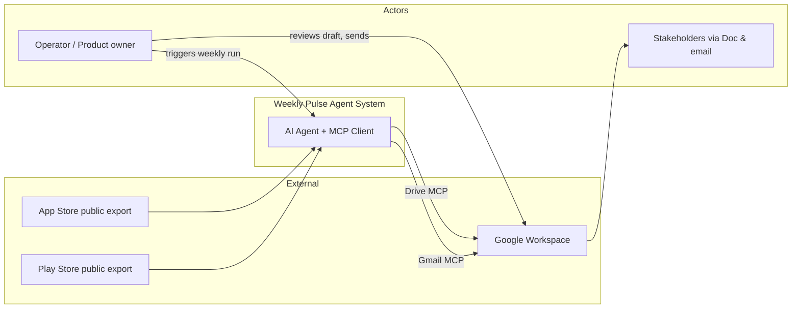
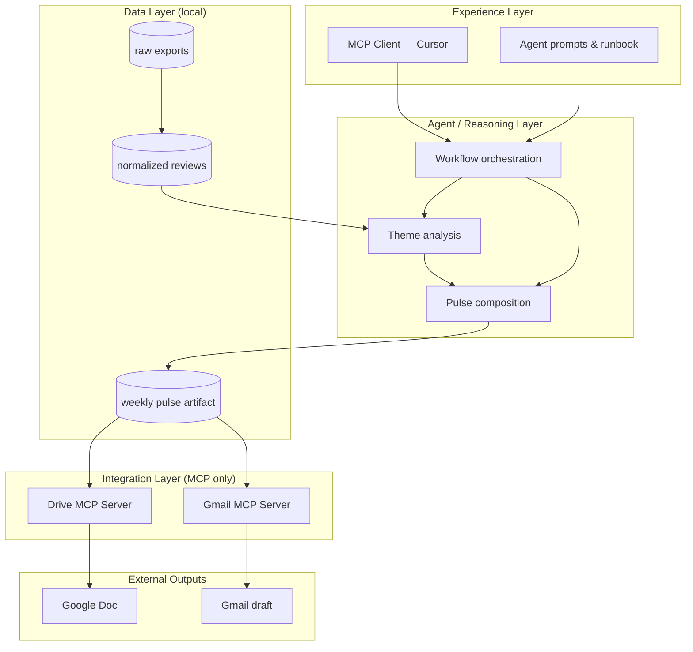
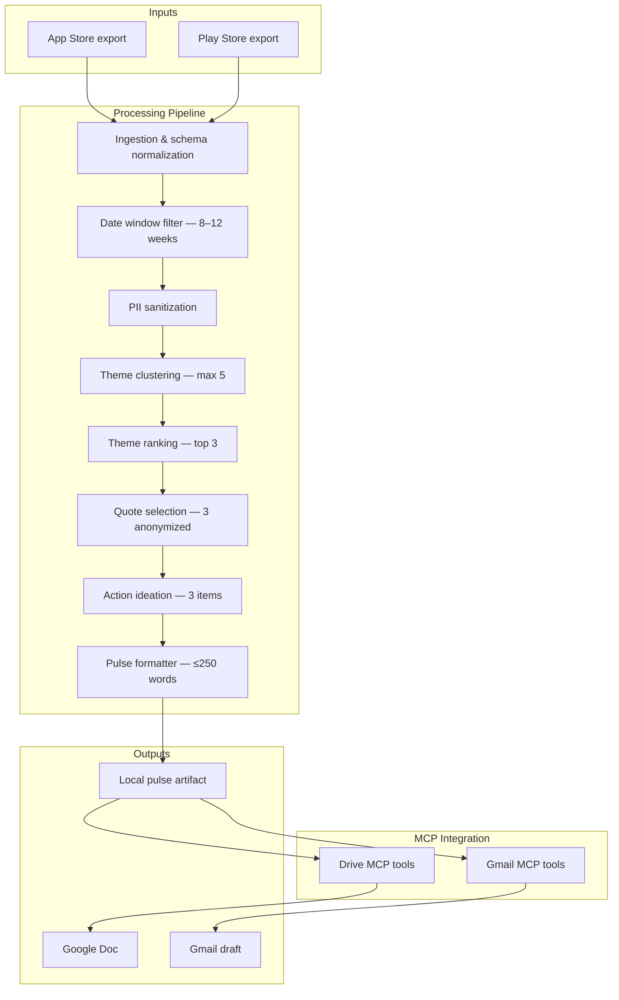
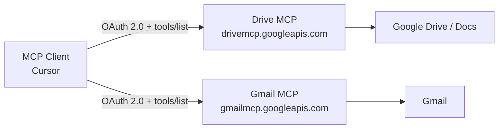
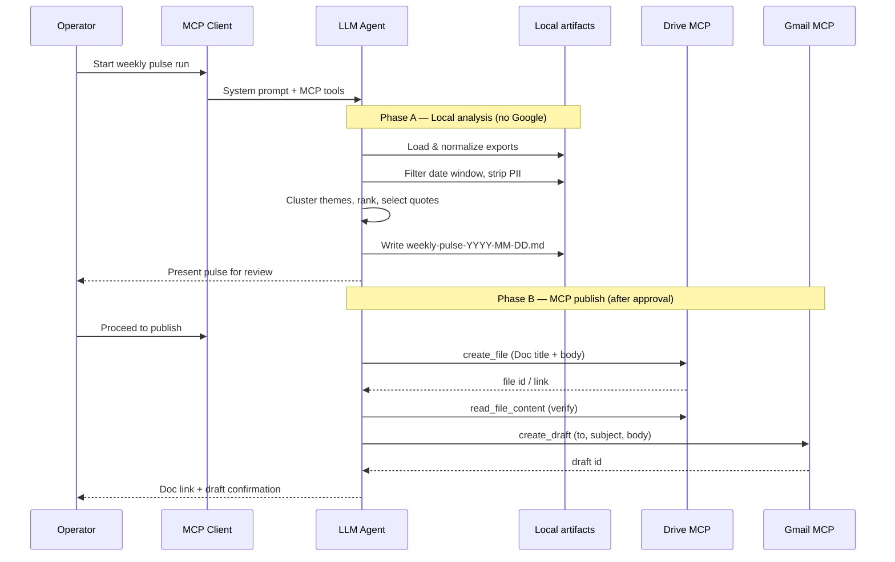
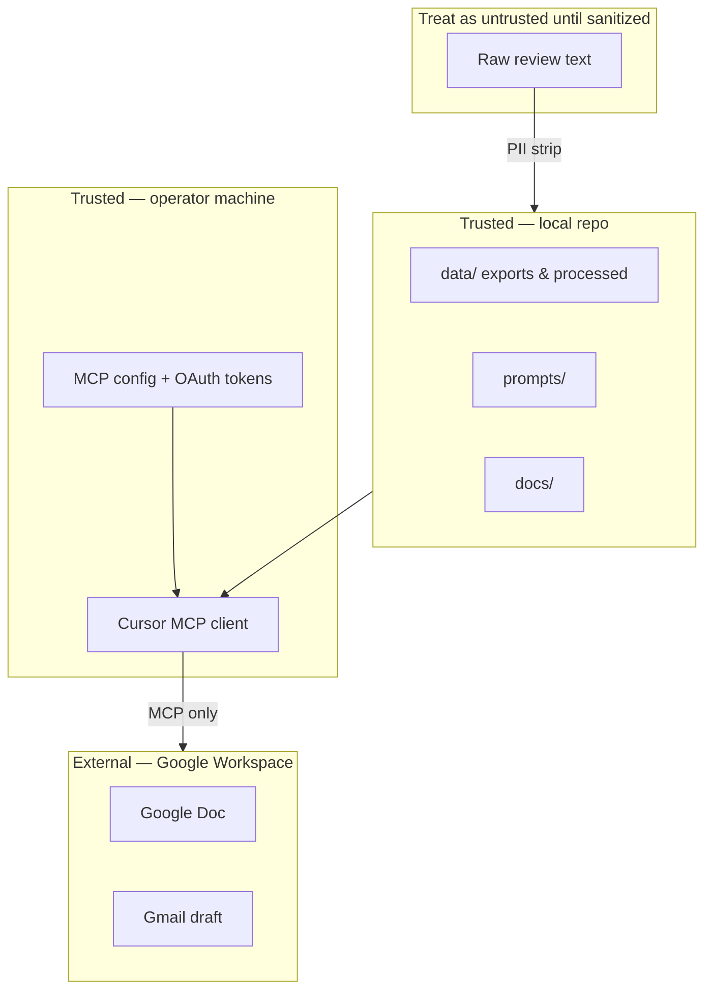

# Architecture — Weekly Review Pulse AI Agent (MCP)

## 1. Purpose & Scope

This document describes the **system architecture** for Milestone 3: an AI agent that converts public mobile app reviews into a weekly executive pulse, persists it to **Google Docs**, and prepares a **Gmail draft** — using **MCP servers** as the sole integration path to Google Workspace.

**In scope**

- Ingesting App Store and Play Store review exports (8–12 weeks)
- Theming, summarization, and pulse generation
- PII-safe outputs
- Google Doc creation via **Drive MCP**
- Gmail draft creation via **Gmail MCP**
- Agent orchestration inside an MCP-capable client

**Out of scope**

- Direct Google REST/SDK calls from application logic
- Automated email send
- Live store scraping or authenticated review APIs
- Custom web UI or scheduled cloud jobs (unless added later)

---

## 2. System Context

The system sits between **static review exports** (inputs) and **Google Workspace** (outputs), with a human operator triggering weekly runs and reviewing drafts before send.



| Actor | Interaction |
|-------|-------------|
| **Operator** | Drops new exports, runs agent, verifies pulse, sends Gmail draft |
| **AI Agent** | Reads data, reasons, calls MCP tools |
| **MCP Client** | OAuth, tool discovery, transports tool calls |
| **Stakeholders** | Read Google Doc or forwarded email pulse |

---

## 3. Architectural Principles

| Principle | Meaning for this project |
|-----------|--------------------------|
| **MCP as Google boundary** | All Gmail and Docs operations cross MCP only; no parallel API integration path |
| **Local-first analysis** | Review parsing, filtering, and pulse drafting happen against local/repo data before any Google publish step |
| **Human gate before publish** | Operator can inspect local pulse artifact; Google steps run only after content is acceptable |
| **Deterministic data, probabilistic synthesis** | Ingestion/normalization are repeatable; theming and summarization are LLM-assisted with fixed output shape |
| **Privacy by design** | PII stripped early; quotes selected only from sanitized text |
| **Fail visibly** | Auth errors, empty data, or MCP failures surface clearly — no silent partial outputs |

---

## 4. Logical Architecture (Layers)



### Layer responsibilities

**Experience layer** — Where the operator works: MCP client, prompts, documentation, eval checklists. No business logic for Google APIs here beyond MCP configuration.

**Agent / reasoning layer** — LLM-driven workflow: assign themes, rank issues, pick quotes, write actions, enforce word limit and structure. Orchestration decides *when* to move from analysis → local artifact → MCP publish.

**Data layer** — Canonical storage for exports, cleaned reviews, and the approved pulse markdown. Source of truth for content parity checks against Doc and email.

**Integration layer** — Remote Google Workspace MCP servers. OAuth and tool contracts owned by MCP client + GCP project.

**External outputs** — Durable deliverables stakeholders actually use.

---

## 5. Component Architecture



| Component | Input | Output | Notes |
|-----------|-------|--------|-------|
| **Ingestion** | Raw CSV/JSON per store | Unified review records | Handles platform-specific column names |
| **Date window filter** | All normalized reviews | Subset for analysis window | Configurable 8–12 weeks |
| **PII sanitization** | Review text + metadata fields | Redacted text | Runs before clustering and quote pick |
| **Theme clustering** | Sanitized reviews | ≤5 theme buckets + assignments | Product-aligned vocabulary |
| **Theme ranking** | Theme buckets | Ordered list; top 3 for pulse | By volume + negative sentiment weight |
| **Quote selection** | Top themes + reviews | 3 short anonymized quotes | Reject if PII detected |
| **Action ideation** | Top themes | 3 concrete recommendations | Tied 1:1 to themes where possible |
| **Pulse formatter** | Themes, quotes, actions | Scannable markdown, ≤250 words | Fixed section structure |
| **Drive MCP bridge** | Final pulse body | Google Doc | Create new file per weekly run |
| **Gmail MCP bridge** | Final pulse body + metadata | Draft email | Draft only; operator sends |

---

## 6. Canonical Data Model

All platforms normalize to the same review shape before analysis.

| Field | Description | Used in pulse |
|-------|-------------|---------------|
| `platform` | `ios` or `android` | Optional context in analysis only |
| `date` | Review date (ISO) | Window filtering |
| `rating` | 1–5 stars | Severity weighting |
| `title` | Review title if present | Theme signals |
| `text` | Review body | Themes, quotes (after PII strip) |
| `source` | Export file / batch id | Traceability only; not in pulse |

**Derived artifacts (local)**

| Artifact | Purpose |
|----------|---------|
| `normalized-reviews.json` | Clean input for theming |
| `theme-summary.json` | Theme counts, rankings, sample review ids |
| `weekly-pulse-YYYY-MM-DD.md` | Human-reviewable pulse before Google publish |

---

## 7. Pulse Document Structure

The weekly note follows a fixed outline so leadership can scan in under two minutes.

```
# [Product] — Weekly Review Pulse (YYYY-MM-DD)

## At a glance
- [1–2 sentence health summary]

## Top themes
1. [Theme A] — [why it matters / prevalence]
2. [Theme B] — ...
3. [Theme C] — ...

## What users are saying
- "[Quote 1]"
- "[Quote 2]"
- "[Quote 3]"

## Recommended actions
1. [Action for theme A]
2. [Action for theme B]
3. [Action for theme C]
```

**Constraints enforced on this structure:** ≤250 words total body, no PII, exactly 3 themes / 3 quotes / 3 actions in the published sections.

---

## 8. MCP Topology

Google Workspace exposes **one MCP server per product**. This project uses two remote HTTP endpoints.



| Server | Endpoint | Primary tools used | Delivers |
|--------|----------|-------------------|----------|
| **Drive MCP** | `https://drivemcp.googleapis.com/mcp/v1` | `create_file`, `read_file_content`, `get_file_metadata` | Weekly pulse Google Doc |
| **Gmail MCP** | `https://gmailmcp.googleapis.com/mcp/v1` | `create_draft` | Draft to self/alias |

**Auth model:** OAuth 2.0 configured in MCP client; tokens never stored in repo. GCP project must enable both MCP APIs and underlying Workspace APIs.

**Tool discovery:** Agent calls `tools/list` at session start; only documented MCP tools are used for Google actions.

---

## 9. End-to-End Workflow



### Workflow stages

| Stage | Where it runs | Google involved? |
|-------|---------------|------------------|
| Load exports | Local / repo | No |
| Normalize & filter | Local | No |
| Sanitize PII | Local | No |
| Theme & pulse generation | Agent (LLM) | No |
| Operator review | Human | No |
| Create Google Doc | Drive MCP | Yes |
| Create Gmail draft | Gmail MCP | Yes |

---

## 10. Trust Boundaries & Security



| Concern | Approach |
|---------|----------|
| **Secrets** | OAuth client secrets and tokens stay in MCP config / env — never committed |
| **PII** | Strip at data layer; re-scan pulse before publish |
| **Data provenance** | Public exports only; document source and date range |
| **Google access** | Least-privilege OAuth scopes required by MCP tools |
| **Audit** | Keep local pulse artifact as reproducible record of what was published |

---

## 11. Error Handling & Recovery

| Failure | System behavior | Operator action |
|---------|-----------------|-----------------|
| Missing or empty exports | Stop before theming; report which file/platform is missing | Add/re-download exports |
| Date window yields too few reviews | Warn; proceed with disclaimer in pulse or abort per runbook | Widen window or wait for more data |
| PII detected in final pulse | Block publish to Google | Regenerate quotes or redact manually |
| Drive MCP auth failure | No Doc created; local pulse preserved | Re-authenticate in MCP client |
| Gmail MCP auth failure | Doc may exist; draft missing | Fix auth; rerun Gmail step only |
| Pulse exceeds 250 words | Regenerate or trim before publish | Adjust prompt constraints |
| MCP tool not found | Stop; log `tools/list` mismatch | Update MCP config / GCP APIs |

**Partial success policy:** Local pulse is always the recovery point. Google steps are idempotent per weekly run (new Doc each week; new draft each run).

---

## 12. Operational Model

| Activity | Frequency | Owner |
|----------|-----------|-------|
| Download new store exports | Weekly | Operator |
| Run full agent workflow | Weekly | Operator |
| Review pulse + send draft | Weekly | Operator |
| Refresh OAuth / MCP health check | Monthly or on failure | Operator |
| Update theme vocabulary | When product surface changes | Product team |

**Weekly run order:** exports → analyze → local pulse → (approve) → Drive MCP → Gmail MCP → manual send.

---

## 13. Repository Layout

```
MILESTONE 3 - AI AGENT WITH MCP/
├── .cursor/
│   └── mcp.json             # Drive + Gmail MCP (secrets via env vars)
├── docs/                    # Problem, architecture, plan, decisions, eval
│   └── phases/              # Per-phase eval.md (exit gates)
├── phases/                  # Per-phase work folders (runbooks, evidence)
│   ├── phase-01-mcp-setup/
│   ├── phase-02-review-ingestion/
│   ├── phase-03-pulse-generation/
│   ├── phase-04-google-docs-mcp/
│   └── phase-05-gmail-orchestration/
├── data/
│   ├── raw/                 # Original store exports (gitignored)
│   └── processed/           # Normalized reviews, pulse artifacts
├── prompts/                 # Agent prompts (Phase 3+)
├── .env.example             # OAuth variable names only
└── README.md
```

---

## 14. Quality Attributes

| Attribute | Target |
|-----------|--------|
| **Correctness** | Doc and email body match approved local pulse |
| **Privacy** | Zero PII in deliverables |
| **Repeatability** | Same exports → same normalized dataset |
| **Maintainability** | Google integration isolated to MCP; prompts/docs explain weekly ops |
| **Observability** | Operator sees Doc link, draft confirmation, and any MCP errors in session |

---

## 15. Related Documents

- [Problem Statement](./problemstatement.md)
- [Implementation Plan](./implementationplan.md)
- [Evaluation (master)](./eval.md)
- [Decisions Log](./decision.md)
