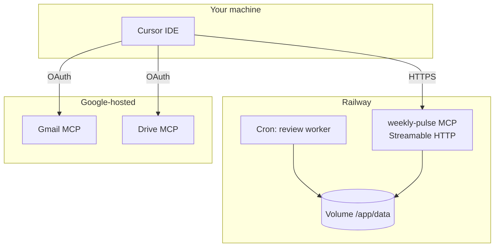

# Railway Deployment Plan — Weekly Pulse MCP

Deploy the **Weekly Pulse agent service** to [Railway](https://railway.app). This hosts your **custom MCP server** (review ingestion tools). **Google Gmail and Drive MCP stay on Google's servers** — Cursor connects to both.

---

## Architecture



| Component | Deploy on Railway? | Endpoint |
|-----------|-------------------|----------|
| **weekly-pulse MCP** (this repo) | Yes | `https://<app>.up.railway.app/mcp` |
| Gmail MCP | No | `https://gmailmcp.googleapis.com/mcp/v1` |
| Drive MCP | No | `https://drivemcp.googleapis.com/mcp/v1` |

---

## What was added to the repo

```
Milestone-3---AI-agent-MCP/
├── deploy/
│   ├── Dockerfile          # Container image
│   └── start.sh            # Optional entry script
├── src/
│   ├── main.py             # MCP server (Streamable HTTP)
│   ├── worker.py           # Cron entrypoint
│   ├── pipeline.py         # Wraps Phase 2 scripts
│   └── config.py           # Paths + env
├── railway.toml            # Railway build + health check
├── .dockerignore
└── docs/deployment-railway.md   # This file
```

### MCP tools exposed on Railway

| Tool | Description |
|------|-------------|
| `fetch_reviews` | Download App Store + Play Store reviews |
| `normalize_reviews` | Clean, filter, de-PII reviews |
| `review_stats` | JSON summary of `data/reviews/reviews.json` |
| `latest_pulse` | Return latest `weekly-pulse-*.md` if present |

### Health check

```
GET https://<app>.up.railway.app/health
→ {"status": "healthy", "service": "weekly-pulse-mcp"}
```

---

## Prerequisites

- [Railway account](https://railway.app)
- [Railway CLI](https://docs.railway.app/develop/cli) (optional)
- GitHub repo pushed (Railway deploys from Git)
- Phase 1 GCP OAuth already working in Cursor (for Gmail/Drive MCP)

---

## Step 1 — Create Railway project

### Option A: Railway Dashboard

1. Go to [railway.app/new](https://railway.app/new)
2. **Deploy from GitHub repo** → select `Milestone-3---AI-agent-MCP`
3. Railway detects `railway.toml` and `deploy/Dockerfile`

### Option B: Railway CLI

```bash
npm i -g @railway/cli
railway login
cd Milestone-3---AI-agent-MCP
railway init
railway up
```

---

## Step 2 — Add a persistent volume

Review data must survive redeploys.

1. Railway project → your service → **Volumes**
2. **Add Volume**
3. Mount path: **`/app/data`**
4. Redeploy

---

## Step 3 — Set environment variables

In Railway → **Variables**:

| Variable | Required | Example |
|----------|----------|---------|
| `GOOGLE_CLOUD_PROJECT_ID` | Recommended | `silver-treat-499611-r3` |
| `GOOGLE_OAUTH_CLIENT_ID` | For Cursor MCP | Web client ID |
| `GOOGLE_OAUTH_CLIENT_SECRET` | For Cursor MCP | Web client secret |
| `GOOGLE_OAUTH_EMAIL` | Recommended | `dhulipudialekhya@gmail.com` |
| `MCP_SERVER_API_KEY` | Optional | Generate a strong random string |
| `DATA_DIR` | Yes (default in Dockerfile) | `/app/data` |
| `PORT` | Auto-set by Railway | — |

**Do not** upload `credentials.json`, `token.json`, or `.env` to Railway unless you use Railway's secret file mount. Google MCP OAuth for Cursor stays on your local machine / Cursor env vars.

---

## Step 4 — Deploy

```bash
railway up
```

Or push to GitHub if connected — Railway auto-deploys.

Verify:

```bash
curl https://YOUR-APP.up.railway.app/health
```

Generate a public domain: Railway → **Settings → Networking → Generate Domain**.

---

## Step 5 — Configure Cursor MCP

Add your Railway server to `.cursor/mcp.json` **alongside** Google MCP:

```json
{
  "mcpServers": {
    "weekly-pulse": {
      "url": "https://YOUR-APP.up.railway.app/mcp"
    },
    "google-drive": {
      "url": "https://drivemcp.googleapis.com/mcp/v1",
      "auth": {
        "CLIENT_ID": "${env:GOOGLE_OAUTH_CLIENT_ID}",
        "CLIENT_SECRET": "${env:GOOGLE_OAUTH_CLIENT_SECRET}"
      }
    },
    "google-gmail": {
      "url": "https://gmailmcp.googleapis.com/mcp/v1",
      "auth": {
        "CLIENT_ID": "${env:GOOGLE_OAUTH_CLIENT_ID}",
        "CLIENT_SECRET": "${env:GOOGLE_OAUTH_CLIENT_SECRET}"
      }
    }
  }
}
```

Restart Cursor after updating.

---

## Step 6 — Optional cron worker

Schedule weekly review fetch on Railway:

1. Create a **second service** in the same project (or use Railway Cron)
2. Use the **same Dockerfile**
3. Override start command:

```bash
python -m src.worker --weeks 10
```

4. Cron schedule: `0 6 * * 1` (Mondays 06:00 UTC)
5. Mount the **same volume** at `/app/data`

---

## Local testing before deploy

```bash
pip install -r requirements.txt
python -m src
# Health: http://localhost:8080/health
# MCP:    http://localhost:8080/mcp
```

Run worker locally:

```bash
python -m src.worker --weeks 10
```

---

## Weekly workflow (production)

| Step | Where | Action |
|------|-------|--------|
| 1 | Railway cron | `fetch_reviews` + `normalize_reviews` |
| 2 | Cursor Agent | Call `weekly-pulse` MCP → generate pulse (Phase 3) |
| 3 | Operator | Approve local `weekly-pulse-*.md` |
| 4 | Cursor Agent | `google-drive` MCP → create Doc |
| 5 | Cursor Agent | `google-gmail` MCP → create draft |
| 6 | Operator | Send email manually from Gmail |

---

## Milestone constraints (unchanged)

- **Gmail/Drive publish** → Google remote MCP only (not Railway)
- **No `googleapis` SDK** in server code for Docs/Gmail
- **Human approval** before Google publish steps
- **No PII** in pulse artifacts

---

## Troubleshooting

| Symptom | Fix |
|---------|-----|
| Health check fails | Check deploy logs; confirm `PORT` is used by `python -m src` |
| MCP tools empty in Cursor | Verify URL ends with `/mcp`; check MCP Logs (`Ctrl+Shift+U`) |
| Reviews missing after redeploy | Attach Railway Volume at `/app/data` |
| `fetch_reviews` timeout | Increase Railway service memory; Play Store pagination is slow |
| Google MCP 403 in Cursor | Add test user in GCP; re-authenticate in Tools & MCP |

---

## Cost estimate

| Resource | Est. monthly |
|----------|--------------|
| Web service (512 MB) | $5–10 |
| Volume (1 GB) | ~$0.25 |
| Cron worker | $1–3 |
| **Total** | **~$7–15** |

---

## Rollout phases

| Phase | Scope | Status |
|-------|-------|--------|
| **P0** | Docker + MCP server + health | Ready in repo |
| **P1** | Railway deploy + volume | Follow steps above |
| **P2** | Cron worker | Optional Step 6 |
| **P3** | Pulse generation on server | Phase 3+ (future) |

---

## Related docs

- [Architecture](./architecture.md)
- [Phase 1 MCP runbook](../phases/phase-01-mcp-setup/runbook.md)
- [GCP setup checklist](../phases/phase-01-mcp-setup/gcp-setup-checklist.md)
- [Cursor MCP docs](https://cursor.com/docs/mcp)
