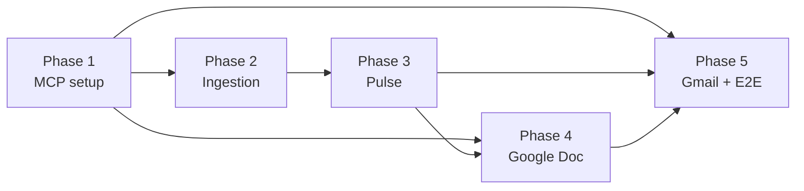
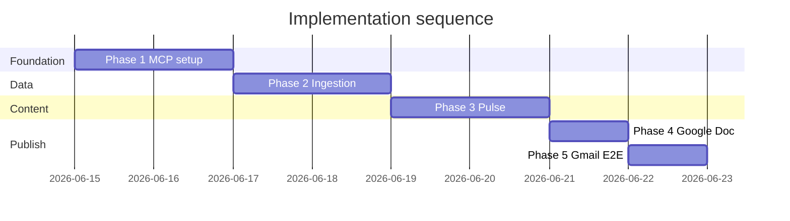

# Implementation Plan — Phase-wise

This plan breaks Milestone 3 into **five sequential phases**. Each phase ends with a gate: the corresponding [eval.md](./eval.md) checklist must pass before the next phase starts.

Track overall milestone readiness in **[eval.md](./eval.md)**.

| Phase | Name | Eval |
|-------|------|------|
| 1 | MCP & project foundation | [phases/phase-01-mcp-setup/eval.md](./phases/phase-01-mcp-setup/eval.md) |
| 2 | Review ingestion & normalization | [phases/phase-02-review-ingestion/eval.md](./phases/phase-02-review-ingestion/eval.md) |
| 3 | Theme analysis & pulse generation | [phases/phase-03-pulse-generation/eval.md](./phases/phase-03-pulse-generation/eval.md) |
| 4 | Google Docs via Drive MCP | [phases/phase-04-google-docs-mcp/eval.md](./phases/phase-04-google-docs-mcp/eval.md) |
| 5 | Gmail draft & end-to-end orchestration | [phases/phase-05-gmail-orchestration/eval.md](./phases/phase-05-gmail-orchestration/eval.md) |

---

## Overview

| Phase | Primary outcome | Blocks |
|-------|-----------------|--------|
| 1 | Google MCP connectivity proven | Phases 4, 5 |
| 2 | Clean review dataset ready | Phase 3 |
| 3 | Approved local weekly pulse | Phases 4, 5 |
| 4 | Live Google Doc via MCP | Phase 5 (full E2E) |
| 5 | Gmail draft + full pipeline | Milestone complete |

**Estimated duration:** 5–8 working days total (see [Suggested Timeline](#suggested-timeline)).

---

## Phase 1 — MCP & Project Foundation

### Objective

Establish the project skeleton, documentation, and **proven connectivity** to Google Drive MCP and Gmail MCP from the MCP client — before any review analysis or publish workflow is built.

### Why this phase comes first

All Google deliverables (Doc + draft) depend on OAuth and MCP tool access. Discovering auth or Workspace admin issues early avoids rework after analysis is complete.

### Prerequisites

- Milestone 1 product identified (which app’s reviews will be used)
- Google account with access to Drive and Gmail
- Ability to create a Google Cloud project (or use an existing one)

### In scope

- Repository and folder conventions (`docs/`, `data/`, `prompts/`)
- Google Cloud project setup for Workspace MCP
- OAuth client and MCP client configuration
- Tool discovery and read-only smoke tests on both servers
- Secrets hygiene (`.env.example`, no credentials in git)

### Out of scope

- Review parsing or pulse generation
- Creating production Docs or drafts with real pulse content
- Automated scheduling

### Detailed activities

1. **Project scaffolding**
   - Align folder layout with [architecture.md](./architecture.md)
   - Ensure eval, decision, and phase docs are linked and discoverable
   - Define where raw exports and processed artifacts will live

2. **Google Cloud configuration**
   - Create or select GCP project for this milestone
   - Enable Drive MCP API, Gmail MCP API, and underlying Drive + Gmail APIs
   - Configure OAuth consent screen (app name, scopes as required by MCP docs)
   - Register OAuth client with redirect URIs supported by the MCP client

3. **MCP client setup**
   - Register Drive MCP endpoint: `https://drivemcp.googleapis.com/mcp/v1`
   - Register Gmail MCP endpoint: `https://gmailmcp.googleapis.com/mcp/v1`
   - Complete OAuth flow for the operator account
   - Capture available tools from `tools/list` for both servers (names and purpose)

4. **Connectivity validation**
   - Drive: list or search files (read-only) to confirm auth
   - Gmail: list drafts or labels (read-only) to confirm auth
   - Document any Workspace admin steps if 403 errors occur (restricted scopes)

5. **Operational baseline**
   - Record MCP config location (e.g. Cursor settings path) in runbook notes
   - List required env variable *names* in `.env.example` (no values)

### Inputs

- Google Cloud access
- MCP client installed and configured

### Outputs

- Working MCP connections to Drive and Gmail servers
- Documented tool inventory per server
- Repo structure ready for data and prompts
- Phase 1 eval signed off

### Validation

- Phase 1 [eval.md](./phases/phase-01-mcp-setup/eval.md): all test cases T1.1–T1.10 and exit criteria

### Risks & mitigations

| Risk | Mitigation |
|------|------------|
| Gmail MCP 403 (Workspace admin) | Follow Google MCP setup guide; request admin trust for OAuth app |
| Wrong OAuth redirect URI | Match MCP client documentation exactly |
| Tool list differs from docs | Record actual tools; adjust Phases 4–5 plans if tool names differ |

### Handoff to Phase 2

Phase 2 can start in parallel with late Phase 1 work (data ingestion does not require MCP), but **Phases 4–5 must not start** until Phase 1 exit criteria pass.

---

## Phase 2 — Review Ingestion & Normalization

### Objective

Turn raw App Store and Play Store **public exports** into a single, clean, PII-scrubbed dataset covering the configured **8–12 week** window — ready for theme analysis.

### Why this phase matters

Downstream theming and quotes are only as good as normalized input. PII must be removed here so later LLM steps never see identifiable data in deliverable paths.

### Prerequisites

- Phase 1 repo structure in place (recommended)
- Public review export files for the Milestone 1 product
- Documented export source URLs and download process

### In scope

- Obtaining and versioning raw export files
- Platform-specific → unified schema mapping
- Date window filtering (8–12 weeks, default 10)
- PII detection and redaction on review text
- Volume and date-range reporting per platform
- Sample fixture for eval reproducibility

### Out of scope

- Theme clustering or pulse writing
- Google Doc or Gmail actions
- Scraping behind store logins

### Detailed activities

1. **Source acquisition**
   - Download latest public exports for iOS and Android
   - Store under `data/raw/` with naming that includes platform and export date
   - Record source URL, export date, and product name in `decision.md`

2. **Schema normalization**
   - Map each store’s columns to canonical fields: `platform`, `date`, `rating`, `title`, `text`, `source`
   - Handle missing titles, multi-line text, and date format differences
   - Drop or flag rows with empty review text

3. **Date windowing**
   - Compute cutoff from run date (e.g. last 10 weeks)
   - Filter normalized set to window; log count before/after
   - Confirm min/max review dates in output meet expectations

4. **PII sanitization**
   - Redact email addresses, @handles, phone-like patterns, obvious account IDs
   - Apply sanitization to all text that could appear in quotes later

5. **Content filters (DEC-016)**
   - Drop reviews with **≤6 words** in title + text (keep only **7+ words**)
   - **Strip emojis** from title and text
   - Keep **English only**; remove Hindi and other languages

6. **Quality reporting**
   - Produce summary: total reviews, per-platform counts, star distribution (optional)
   - Identify if volume is too low for meaningful theming (< threshold → escalate in runbook)

6. **Artifact persistence**
   - Write normalized output to `data/processed/`
   - Retain small anonymized fixture for phase eval tests

### Inputs

- `data/raw/` App Store export
- `data/raw/` Play Store export
- Configured week window (8–12)

### Outputs

- Normalized review dataset (processed)
- Ingestion summary report (counts, date range)
- Documented export provenance in `decision.md`
- Phase 2 eval signed off

### Validation

- Phase 2 [eval.md](./phases/phase-02-review-ingestion/eval.md): T2.1–T2.10, PII checks, reproducibility

### Risks & mitigations

| Risk | Mitigation |
|------|------------|
| Export schema changes | Document column mapping per source; version exports |
| Low review volume in window | Widen toward 12 weeks with decision log entry |
| PII patterns missed | Expand rules; manual spot-check 20 reviews |

### Handoff to Phase 3

Deliver normalized, sanitized dataset and summary stats. Phase 3 owner confirms volume is sufficient to proceed.

---

## Phase 3 — Theme Analysis & Pulse Generation

### Objective

Produce a **complete weekly pulse** — top 3 themes, 3 anonymized quotes, 3 action ideas, ≤250 words, scannable format — as a **local markdown artifact** approved before any Google publish step.

### Why this phase is separated from Google integration

Content quality and constraint compliance (PII, word limit, structure) should be validated independently of MCP. This reduces risk of publishing bad content to Drive or Gmail.

### Prerequisites

- Phase 2 complete: normalized dataset available
- Product theme vocabulary agreed (e.g. onboarding, KYC, payments, statements, withdrawals)
- Agent prompts directory ready

### In scope

- Assigning reviews to ≤5 themes using product-aligned vocabulary
- Ranking themes; selecting top 3 for the pulse
- Choosing 3 representative quotes from sanitized text
- Generating 3 actionable recommendations
- Formatting fixed pulse structure (see architecture doc)
- Enforcing ≤250 words and zero PII in final artifact
- Saving `weekly-pulse-YYYY-MM-DD.md` locally

### Out of scope

- Creating Google Doc or Gmail draft
- Sending email
- Changing ingestion rules (feed back to Phase 2 if data issues found)

### Detailed activities

1. **Theme vocabulary alignment**
   - Lock theme labels to Milestone 1 product domain
   - Define when to use “Other” or merge low-volume themes (still ≤5 total)

2. **Clustering & assignment**
   - Group reviews into theme buckets (max 5)
   - Tag each bucket with approximate volume and sentiment skew (e.g. % ≤2 stars)

3. **Ranking**
   - Rank themes by combination of frequency and severity (low ratings weigh higher)
   - Select top 3 for executive pulse; retain full 5-theme summary internally if useful

4. **Quote selection**
   - Pick one strong quote per top theme (or best coverage across three)
   - Trim for clarity; ensure no PII remnants
   - Reject and replace quotes that fail PII scan

5. **Action ideation**
   - Write 3 specific, feasible next steps mapped to top themes
   - Avoid generic advice (“improve UX”); prefer observable outcomes

6. **Pulse composition**
   - Fill fixed template: at-a-glance, top themes, quotes, actions
   - Count words; iterate until ≤250
   - Format for scanability (headings, bullets, short sentences)

7. **Review gate**
   - Operator reads local markdown artifact
   - Sign-off recorded before Phase 4 begins

### Inputs

- Normalized review dataset from Phase 2
- Theme vocabulary
- Agent prompts for analysis and writing

### Outputs

- `weekly-pulse-YYYY-MM-DD.md` (approved)
- Optional `theme-summary.json` with counts and rankings
- Phase 3 eval signed off

### Validation

- Phase 3 [eval.md](./phases/phase-03-pulse-generation/eval.md): structure, word count, PII, content rubric

### Risks & mitigations

| Risk | Mitigation |
|------|------------|
| Themes too generic | Constrain vocabulary; inject product glossary in prompt |
| Pulse over word limit | Dedicated trim pass; shorten “at a glance” first |
| Quotes still identifiable | Paraphrase while preserving sentiment |
| LLM hallucinated actions | Ground actions in theme evidence; manual review |

### Handoff to Phase 4

Approved local pulse file is the **content contract** for Google Doc and Gmail body in subsequent phases.

---

## Phase 4 — Google Docs via Drive MCP

### Objective

Publish the approved weekly pulse to a **new Google Doc** using **Drive MCP tools only**, with content parity verified against the local artifact.

### Why Drive MCP for Docs

Google does not expose a separate Docs MCP server in the official Workspace MCP setup; document files are created and read through Drive MCP. This is an architectural constraint, not an optional integration style.

### Prerequisites

- Phase 1 complete: Drive MCP authenticated and tools documented
- Phase 3 complete: approved `weekly-pulse-YYYY-MM-DD.md`
- Doc naming convention decided (record in `decision.md`)

### In scope

- Defining Doc title format: `[Product] Weekly Pulse — YYYY-MM-DD`
- Mapping pulse markdown to content acceptable by Drive MCP `create_file` (or equivalent)
- Creating Doc via MCP tool call
- Read-back verification via MCP (`read_file_content` / metadata)
- Confirming no direct Drive/Docs API usage anywhere in project logic

### Out of scope

- Rich Docs formatting beyond what MCP supports
- Sharing permissions automation (document default sharing manually if needed)
- Gmail draft (Phase 5)

### Detailed activities

1. **Pre-publish checklist**
   - Confirm local pulse is final and PII-scanned
   - Confirm OAuth token valid (quick Drive read-only call)

2. **Doc creation**
   - Invoke Drive MCP to create new Google Doc with agreed title
   - Body = approved pulse content (structure preserved as plain text / supported format)

3. **Verification**
   - Fetch metadata or content via MCP
   - Open Doc in browser; compare themes, quotes, actions, and word count to local file
   - Record Doc link or file id in run output (not committed if policy forbids)

4. **Policy: new file per week**
   - Each weekly run creates a **new** Doc (historical archive in Drive)
   - Avoid overwriting prior pulses unless explicitly changed in `decision.md`

5. **Failure handling**
   - If MCP fails, local pulse remains source of truth; retry after auth fix
   - Document recovery steps in runbook

### Inputs

- Approved `weekly-pulse-YYYY-MM-DD.md`
- Drive MCP connection from Phase 1

### Outputs

- Live Google Doc in operator’s Drive
- Documented MCP tool sequence used
- Phase 4 eval signed off

### Validation

- Phase 4 [eval.md](./phases/phase-04-google-docs-mcp/eval.md): MCP-only audit, content parity, title convention

### Risks & mitigations

| Risk | Mitigation |
|------|------------|
| Formatting loss in Doc | Accept plain structure; prioritize readable sections |
| create_file params unclear | Use tools/list output from Phase 1 as reference |
| Wrong Drive account | Verify OAuth account before publish |

### Handoff to Phase 5

Doc URL/file id + unchanged local pulse ready to embed in Gmail draft.

---

## Phase 5 — Gmail Draft & End-to-End Orchestration

### Objective

Create a **Gmail draft** to self or alias via **Gmail MCP only**, then prove the **full weekly workflow** runs end-to-end: exports → pulse → Doc → draft — with runbook for repeat operation.

### Prerequisites

- Phases 1, 3, 4 complete
- Gmail recipient decided (self vs alias) in `decision.md`
- Subject line template agreed

### In scope

- Gmail draft via MCP `create_draft` (or equivalent tool name from discovery)
- Subject template: `Weekly Pulse — [Product] — YYYY-MM-DD`
- Email body = pulse content (optionally include Doc link)
- Master orchestration prompt / runbook tying all phases together
- Full E2E demonstration on real data
- Milestone eval and problem statement success criteria

### Out of scope

- Auto-send (operator sends manually from Gmail UI)
- Calendar invites, labels, or advanced Gmail automation

### Detailed activities

1. **Draft composition**
   - To: documented recipient (self or alias)
   - Subject: dated, product-named
   - Body: full pulse text; optional link to Google Doc from Phase 4

2. **Gmail MCP publish**
   - Call `create_draft` via MCP
   - Confirm draft appears in Gmail Drafts folder in UI

3. **End-to-end orchestration**
   - Define single “weekly run” procedure spanning all phases
   - Clarify human pause point: after local pulse approval, before Google steps
   - Clarify partial failure behavior (Doc ok, draft failed → rerun Gmail only)

4. **Runbook**
   - How to refresh exports weekly
   - How to re-auth MCP if tokens expire
   - Expected runtime and checklist references
   - Where evidence lives for eval sign-off

5. **Milestone verification**
   - Complete master [eval.md](./eval.md) M1–M10
   - Complete Phase 5 [eval.md](./phases/phase-05-gmail-orchestration/eval.md)
   - Capture E2E evidence (timestamp, Doc, draft screenshot internal)

### Inputs

- Approved local pulse
- Google Doc link from Phase 4 (optional in body)
- Gmail MCP connection from Phase 1

### Outputs

- Gmail draft ready for operator send
- End-to-end runbook
- Milestone complete per problem statement

### Validation

- Phase 5 eval + master eval milestone acceptance

### Risks & mitigations

| Risk | Mitigation |
|------|------------|
| Draft created but wrong recipient | Verify in Gmail UI before any send |
| E2E too manual | Document clearly; automation out of scope |
| Operator skips approval gate | Runbook mandates local pulse sign-off |

### Handoff

Milestone delivery: repeatable weekly process, all docs and evals signed.

---

## Cross-Phase Dependencies

| From | To | Dependency type |
|------|-----|-----------------|
| Phase 1 | Phase 4, 5 | Hard — MCP auth required |
| Phase 2 | Phase 3 | Hard — clean data required |
| Phase 3 | Phase 4, 5 | Hard — approved pulse required |
| Phase 4 | Phase 5 | Soft — draft can reference Doc link |

---

## Suggested Timeline

| Phase | Effort | Can overlap? |
|-------|--------|--------------|
| 1 — MCP setup | 1–2 days | Phase 2 late tasks if repo ready |
| 2 — Ingestion | 1–2 days | After repo scaffold |
| 3 — Pulse generation | 1–2 days | No |
| 4 — Google Docs MCP | 0.5–1 day | After Phase 1 + 3 |
| 5 — Gmail + E2E | 1 day | After Phase 4 |

**Total:** ~5–8 working days for one operator.

---

## Risk Register (program level)

| Risk | Impact | Likelihood | Mitigation |
|------|--------|------------|------------|
| Workspace MCP auth blocked | High | Medium | Early Phase 1; admin trust |
| Insufficient reviews in window | Medium | Low | Widen window; note in pulse |
| PII in published quote | High | Low | Phase 2 + 3 scans; block publish |
| MCP tool surface changes | Medium | Low | Pin tool names from Phase 1 discovery |
| Pulse quality inconsistent | Medium | Medium | Fixed template + human approval gate |

---

## Related Documents

- [Architecture](./architecture.md)
- [Problem Statement](./problemstatement.md)
- [Evaluation (master)](./eval.md)
- [Decisions Log](./decision.md)
